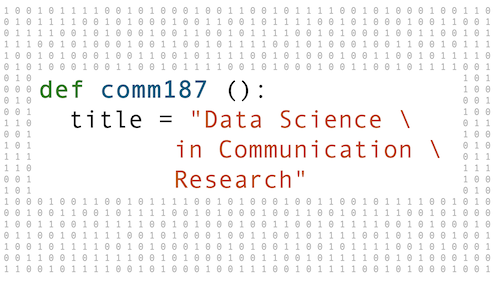

# COMM187 Data Science in Communication Research
Materials and Python notebooks for COMM 187 (160DS) Data Science in Communication Research offered at UC Santa Barbara.
Students enrolled in the class can access readings, syllabus, and other materials on Canvas.

**Fall 2024** \
**Mon/Wed, 2 PM - 3:15 PM, ELLSN 2617**

**Instructors** \
Prateekshit "Kanu" Pandey \
TA: Brittany Wheeler

## Course Aims and Outcomes
The aim of this course is to help you understand the core components and methodologies of data science research, critically think about the applications and utility of data science in communication research, and develop programming skills in Python to conduct beginner level data analysis and visualizations.

By the end of this course, you will be able to:

 - Identify and analyze the role of big data in day-to-day life

 - Critically analyze the ethics of data collection, development, storage, and analysis

 - Think about communication research problems “algorithmically”

 - Do programming in Python at a beginner level

 - Identify instances of effective data storytelling and spot misleading forms of data journalism in daily digital media

## Coding Lab
Each week, we will have an in-person "Coding Lab" where we will learn data analysis using Python programming language.

**Coding Lab #1**: Coming Soon

**Coding Lab #2**: Coming Soon

**Coding Lab #3**: --

**Coding Lab #4**: Coming Soon

**Coding Lab #5**: Coming Soon

**Coding Lab #6**: Coming Soon

**Coding Lab #7**: Coming Soon

**Coding Lab #8**: Coming Soon

**Coding Lab #9**: Coming Soon

## Coding Assignments
One coding assignment will be due each week. These assignments will test the programming skills learnt and discussed in the week before.

[**Coding Assignment #1**]()

[**Coding Assignment #2**]()

[**Coding Assignment #3**]()

[**Coding Assignment #4**]()

[**Coding Assignment #5**]()

[**Coding Assignment #6**]()

[**Coding Assignment #7**]()

[**Coding Assignment #8**]()

[**Coding Assignment #9**]()

[**Coding Assignment #10**]()
